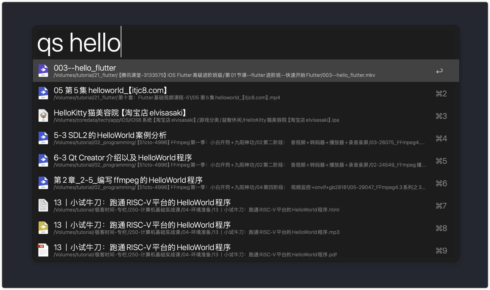
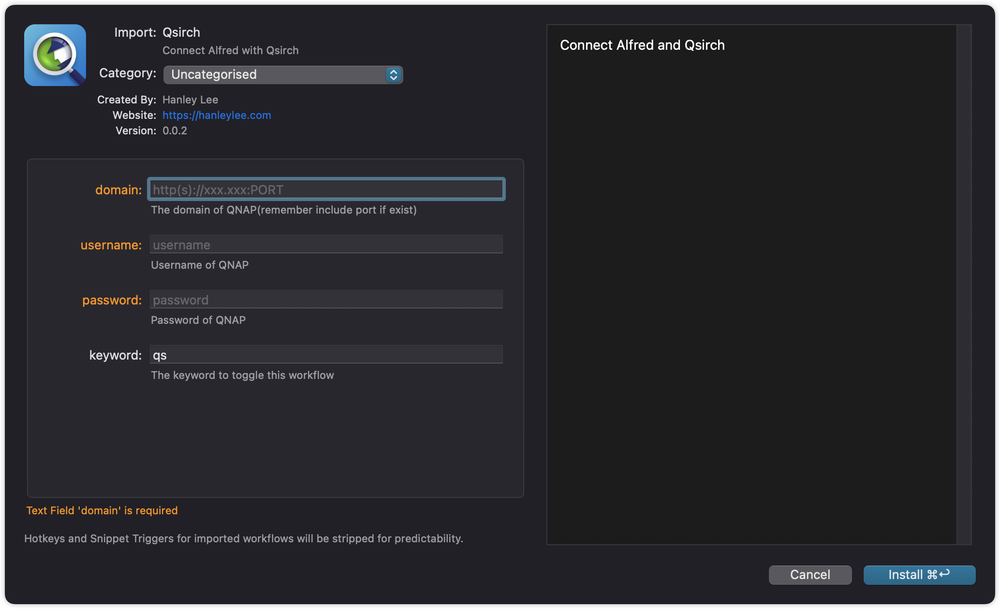
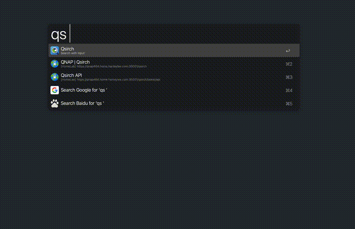

# Alfred Timestamp Converter

This Alfred Workflow aims to search all content in your QNAP via Qsirch API.

## Installation

1. Go to [Releases](https://github.com/hanleylee/alfred-qsirch-workflow/releases) page to download the latest release file named *Qsirch.alfredworkflow*.
2. Double click `Qsirch.alfredworkflow` in your local folder to install.

    

    You are required to input 3 necessary property: `domain`, `username`, `password`

3. Finish!

## Usage

- `qs {query}`: Input any query to search

### qs

### Use Alfred Modifier over the result item

- `↩`: Copy file path to clipboard
- `⌘ + ↩`: Reveal file in Finder(Mount your remote disk on your Mac at first.)
- `⌃ + ↩`: Open file in FileStation
- `⌥ + ↩`: Download file
- `⇧`: Preview file in without exit Alfred

## Development

Open `Package.swift` with Xcode. All settings should be work well.

## TODO

- [x] Support various icon on the left side of each result item.

## Ref

- [Instantly search your Qnap files and emails via Qsirch API](https://piszek.com/2023/03/19/qnap-qsirch-php-api-alfred/)
- [Script Filter JSON Format](https://www.alfredapp.com/help/workflows/inputs/script-filter/json/)
- [ALFRED WORKFLOW SCRIPTFILTER (ANOTHER ONE)](https://sleeplessmind.com.mo/news/alfred-workflow-scriptfilter-another-one/)

## License

All codes in this warehouse are distributed and used based on [Apache License 2.0](http://www.apache.org/licenses/LICENSE-2.0). For the full text of
the agreement, see [LICENSE](https://github.com/hanleylee/alfred-timestamp-converter-workflow/blob/main/LICENSE) file.

Copyright 2021 HanleyLee

---

Welcome, if you have any bugs, I hope to raise issues. If it is useful to you, please mark a star ⭐️

